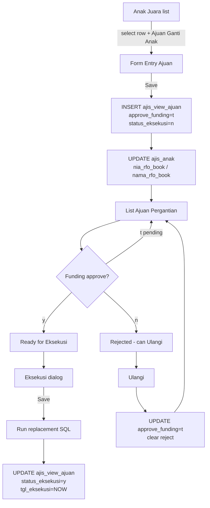

# PRD — Fitur Ajuan Ganti Anak

**Product:** AJIS / Indonesia Juara  
**Module:** Beasiswa Anak Juara  
**Status:** Documented from legacy codebase (PHP + EasyUI) for Next.js migration  
**Date:** 2026-08-11  
**Source files (legacy):**
- UI Anak Juara: `modules/ajis/html/AnakJuaraBaru.html`, `modules/ajis/script/AnakJuaraBaru.js`
- UI List Ajuan: `modules/ajis/html/AjisPergantianAnak.html`, `modules/ajis/script/AjuanCepi.js`
- API entry: `modules/ajis/AnakJuaraBaruAdmin.php`, `modules/ajis/AjisPergantianAjuan.php`
- Business logic: `modules/ajis/class/AnakJuaraBaruClass.php` (`AjuanGantiAnak`), `modules/ajis/class/ClassCepi.php` (`AnakJuara_GantiAnak`, `ulangi_ajuan`, `read_AJP`)

---

## 1. Overview

**Ajuan Ganti Anak** is a request workflow to replace a sponsored child (*anak juara*) under the same donor/program pairing.

Flow in short:

1. User opens **Anak Juara**, selects a row, clicks **+ Ajuan Ganti Anak**, fills the form, saves.
2. System **INSERT**s a request into table `ajis_view_ajuan` (despite the name, this is a **real table**, not a MySQL VIEW).
3. The request appears in menu **List Ajuan Pergantian**.
4. Funding (RFO) approves/rejects (`approve_funding`).
5. Cabang/admin clicks **Eksekusi** → system runs the real child-replacement queries (stop old pairing, create new pairing, move donation/saldo, mark ajuan executed).
6. **Ulangi** resets approval status so funding can re-approve.

There is also a separate button **Ganti Anak** on Anak Juara that executes replacement **immediately** (no ajuan queue). This PRD focuses on the **Ajuan** path, but documents the shared Eksekusi SQL because Eksekusi reuses the same replacement logic.

---

## 2. Goals & Non-Goals

### Goals
- Document end-to-end UX, filters, status machine, and SQL side effects.
- Provide a clear contract for Next.js rewrite.
- Define a faster Anak Juara list query that avoids heavy MySQL views / donation pivots for the first migration phase.

### Non-Goals (phase 1 Next.js)
- Full monthly donation/penyaluran pivot columns (Jan–Des) are **optional**.
- Listing Anak Juara from `ajis_pemasangan` only (without joining pivoted donasi) is acceptable for the first release.

---

## 3. Actors & Roles

| Actor | `id_group_user` | Role in flow |
|---|---|---|
| Admin IJ (Pusat) | `1` | Full access — sees all kantors, all data |
| SpMD Cabang | `2` | Scoped to own `id_kantor` only — create ajuan, run Eksekusi / Ulangi / Delete |
| Funding (RFO / ZAMS) | — | Approve or reject ajuan (`approve_funding` = `y` / `n`) while status is pending (`t`) |
| System | — | Persist ajuan, book replacement child (`nia_rfo_book`), execute pairing changes |

### 3.1 User table: `ajis_user`

Key columns used for authentication and data scoping:

| Column | Notes |
|---|---|
| `id_user` | PK |
| `username` | Login credential |
| `password` | MD5 hash |
| `id_kantor` | Office code — e.g. `'09-219'`, `'09-197'` |
| `nama_kantor` | Denormalized office name |
| `id_group_user` | `1` = Admin / Pusat, `2` = SpMD Cabang |
| `aktif` | enum `y/n` — must be `'y'` to allow login |
| `id_wilayah_pembinaan` | Optional wilayah scope |

Reference data:

```sql
-- Admin Pusat (group 1 — no kantor restriction)
INSERT INTO sipc_ijf.ajis_user
  (id_user, username, password, id_kantor, nama_kantor, id_group_user, aktif)
VALUES (2, 'deploy', 'cdac33fcdadadffd53ff00332756d087', '09-219', 'RZ - Pusat', 1, 'y');

-- SpMD Cabang Aceh (group 2 — scoped to RZ-Aceh only)
INSERT INTO sipc_ijf.ajis_user
  (id_user, username, password, id_kantor, nama_kantor, id_group_user, aktif)
VALUES (49, 'spmd.aceh', 'd1890ef0533fae029357f92f260f4ad0', '09-197', 'RZ - Aceh', 2, 'y');
```

---

## 3a. Authentication & Multi-Tenant Data Isolation

> **This is a first-class concern.** Isolation must be enforced from the login step itself — not as an afterthought on individual queries.

### Login flow

1. User submits `username` + `password`.
2. Server queries `ajis_user` where `username = ?` AND `password = MD5(?)` AND `aktif = 'y'`.
3. On success, store in session:
   - `session.id_user`
   - `session.id_group_user`
   - `session.id_kantor`
   - `session.nama_kantor`
4. Every subsequent API request reads `session.id_group_user` and `session.id_kantor` **before building any query**, to determine the data scope for that user.

```sql
SELECT id_user, id_group_user, id_kantor, nama_kantor, aktif
FROM sipc_ijf.ajis_user
WHERE username = :username
  AND password = MD5(:password)
  AND aktif = 'y'
LIMIT 1;
```

### Isolation rules

| `id_group_user` | Rule |
|---|---|
| `1` (Admin / Pusat) | No forced filter — sees all kantors; `id_kantor` filter is optional UI param |
| `2` (SpMD Cabang) | **Always** append `AND id_kantor = :session_id_kantor`, even if UI sends no kantor param |

### Affected data surfaces

| Surface | Enforcement for group-2 |
|---|---|
| **Anak Juara list** (`GET /api/anak-juara`) | Force `p.kantor_id = session.id_kantor` on `ajis_pemasangan` |
| **List Ajuan Pergantian** (`GET /api/ajuan-ganti-anak`) | Force `id_kantor = session.id_kantor` on `ajis_view_ajuan` |
| **Create Ajuan** | `id_kantor` written to DB must equal `session.id_kantor` |
| **Eksekusi / Ulangi / Delete** | Verify row's `id_kantor = session.id_kantor` before any mutation |

### Implementation contract (Next.js)

```typescript
// Utility — call at the top of every protected route handler
function getKantorScope(session: Session): string | null {
  if (session.id_group_user === 1) return null; // admin: no forced scope
  return session.id_kantor;                       // cabang: always scoped
}

// Usage in query builder
const kantorScope = getKantorScope(session);
if (kantorScope) {
  query.where('kantor_id', kantorScope); // unconditional for group-2
}
```

### What NOT to do

- Do **not** rely only on a UI kantor dropdown to scope data — a group-2 user must never be able to retrieve another office's data by manipulating request params.
- Do **not** trust `id_kantor` sent by the client body or query string for group-2 — always override with `session.id_kantor`.
- Admin (`id_group_user = 1`) may optionally filter by kantor via UI param; if omitted, they see all offices.

---

## 4. User Journey



### Row color meaning (List Ajuan)
| Condition | UI color |
|---|---|
| `approve_funding = y` AND `status_eksekusi != y` | Green (approved, not yet executed) |
| `status_eksekusi = y` | Blue (executed) |
| `approve_funding = n` | Red (rejected) |

---

## 5. Screen Specs

### 5.1 Anak Juara — button **+ Ajuan Ganti Anak**

**Entry:** Menu `Beasiswa Anak Juara` → `Anak Juara`  
**Datagrid URL (current):** `?mod=ajis&file=AnakJuaraBaru&m=r_view` → `AnakJuaraBaru_Read()`  
**Source (current):** MySQL VIEW `ajis_view_anak_juara` (heavy).

**Action:**
1. Select one row in datagrid.
2. Click **+ Ajuan Ganti Anak** → `addAjuan()`.
3. Dialog `#addGantiAnak` opens, form `#fmAjuanGantiAnak` preloaded from selected row.

**Form fields (Entry Ajuan):**

| Field | Form name | Source / notes |
|---|---|---|
| ID Pasang | `id_pemasangan_baru` | From selected row |
| ID Kantor | `id_kantor_ajuan` | From row |
| Kantor Cabang | `nama_kantor_ajuan` | From row |
| ID Wilayah | `id_wilayah_pembinaan_ajuan` | From row |
| Wilayah Binaan | `nama_wilayah_ajuan` | From row |
| Tanggal Ajuan | `tgl_ajuan` | Datebox (DB insert uses `NOW()`) |
| ID Donatur | `id_donatur` | From row |
| oID Donatur | `oid_donatur` | From row |
| Nama Donatur | `nama_donatur` | From row |
| Id Funding | `nia_rfo` | From row |
| Nama Funding | `nama_rfo` | From row |
| Kantor Donatur | `kantor_donatur` | From row |
| Program beasiswa | `program_beasiswa` | From `program_donasi` |
| Jenis Donatur | `jenis_donatur` | From row |
| No HP | `hp` | From row |
| Pindah Saldo | `pindah_saldo` | Numeric amount planned to move |
| ID Anak Asal | `id_anak_asal` | Old child |
| Nama Anak Asal | `nama_anak_asal` | Old child |
| Alasan Pergantian | `alasan_pergantian` | Free text (required business-wise) |
| Type ganti | `tipe_ganti_ajuan` | `anak_existing` \| `pemasangan_baru` |
| Anak Pengganti | `anak_pengganti` (+ hidden `nama_anak_pengganti`) | Combogrid by type |
| Keterangan | `keterangan` | Free text |

**Anak Pengganti options:**
- `anak_existing` → `m=read_ganti_anak`  
  Source: `ajis_pemasangan` where `status_pasangan = 'n'` and `tahun = YEAR(NOW())`
- `pemasangan_baru` → `m=read_ganti_anak_calon`  
  Source: `ajis_anak` where `status_anak_juara = 'caj'` and `aktif = 'y'`

**Save endpoint:**  
`POST ?mod=ajis&file=AnakJuaraBaruAdmin&m=AjuanGantiAnak`  
→ `CCashflowPenyaluran::AjuanGantiAnak()`

Success message (legacy): *"Data berhasil disave ! silahkan cek di menu list view ajuan untuk mengetahui update dari funding"*

---

### 5.2 List Ajuan Pergantian

**Entry:** Menu `Beasiswa Anak Juara` → `List Ajuan Pergantian`  
**File:** `AjisPergantianAjuan.php` + `AjisPergantianAnak.html`  
**Datagrid URL:** `?mod=ajis&file=AjisPergantianAjuan&m=r` → `CPAjis::read_AJP()`  
**Table:** `sipc_ijf.ajis_view_ajuan`

#### Toolbar actions

| Button | Handler | Endpoint | Effect |
|---|---|---|---|
| Export | `Exportxls()` | `m=doExport` | Excel export of filtered list |
| Delete | `deleteAjuan()` | `m=d` | `DELETE FROM ajis_view_ajuan WHERE id_ajuan = ?` |
| Eksekusi | `gantiAnak()` | opens dialog, then Save → `m=ganti_anak` | Runs full replacement SQL + marks executed |
| Ulangi | `ulangi()` | `m=ulangi` | Resets approval to pending |

#### Filters (must be preserved in Next.js)

| Filter UI | Param | SQL condition |
|---|---|---|
| Kantor | `kantor_id` | `AND id_kantor = '{kantor_id}'` |
| Bulan | `bulan2` | `AND MONTH(tgl_ajuan) = '{bulan2}'` (1–12; UI also has Jan–Jun / Jul–Des labels but backend uses month number) |
| Tahun | `tahun` | `AND YEAR(tgl_ajuan) = '{tahun}'` |
| Approve | `approve_funding` | `AND approve_funding = '{y\|n\|t}'` |
| Eksekusi | `status_eksekusi` | `AND status_eksekusi = '{y\|n}'` |
| Search | `keySearch` | LIKE on `id_anak_pengganti`, `id_anak`, `nama_anak_pengganti`, `nama_anak_asal`, `id_donatur`, `nama_donatur`, `nia_rfo`, `nama_rfo` |
| (auto) Cabang session | — | if group=2: `AND id_kantor = SESSION.id_kantor` |

#### List columns

Frozen:
- `status_eksekusi` (icon)
- `tgl_approve_funding`
- `tgl_ajuan`
- `tgl_eksekusi`

Scrollable:
- `id_kantor`, `nama_kantor`
- `id_donatur`, `nama_donatur`
- `program_donasi`
- `nia_rfo`, `nama_rfo`
- `id_anak`, `nama_anak_asal`
- `alasan_pergantian`
- `id_anak_pengganti`, `nama_anak_pengganti`
- `keterangan`
- `pindah_saldo`
- `alasan_reject`
- `id_pemasangan_baru`

Pagination: 10/20/30/50/100/150/200 per page; order `tgl_ajuan DESC`.

---

### 5.3 Eksekusi dialog (from List Ajuan)

Triggered by **Eksekusi** → confirmation *"Sudah Update Saldo Akhir ?"*.

Dialog loads:
- Profile/keuangan from `m=pemasangan_detail` (reads `ajis_view_anak_juara` by `id_pemasangan_baru`)
- Keuangan grid from `AnakJuaraBaru&m=r_wh_detail`
- Donasi to transfer from `AnakJuaraBaru&m=donasi_pindah&id_anak=&id_donatur=`
- Prefilled `id_anak_pengganti`, `nama_anak_pengganti`, `alasan_pergantian` from ajuan row

**Editable execution fields:**
- `id_input_donasi_ganti[]` — multi-select donations to move
- `keterangan_pemberhentian` — stop reason for old child
- `saldo_akhir_ganti` — amount moved to new child opening balance
- `saldo_awal_ganjil`, `saldo_akhir_ganjil`, `saldo_awal_genap`, `saldo_akhir_genap` — semester balances for **old** child opname

**Save endpoint:**  
`POST ?mod=ajis&file=AjisPergantianAjuan&m=ganti_anak&id_pemasangan_baru=...&id_ajuan=...`  
→ `CPAjis::AnakJuara_GantiAnak()`

---

## 6. Status Machine

### `approve_funding` enum
| Value | Meaning |
|---|---|
| `t` | Pending approval (default on insert) |
| `y` | Approved by funding |
| `n` | Rejected by funding |

### `status_eksekusi` enum
| Value | Meaning |
|---|---|
| `n` / empty | Not executed (insert sets `'n'`) |
| `y` | Executed |

### Transitions
| Action | From | To |
|---|---|---|
| Create Ajuan | — | `approve_funding=t`, `status_eksekusi=n` |
| Funding Approve* | `t` | `y` + `tgl_approve_funding` |
| Funding Reject* | `t` | `n` + optional `alasan_reject` |
| Ulangi | any approve | `approve_funding=t`, `tgl_approve_funding=0000-00-00`, `alasan_reject=''` |
| Eksekusi Save | approved (business expectation) | `status_eksekusi=y`, `tgl_eksekusi=NOW()` |

\* Funding approve/reject UPDATE is **not implemented in this repo’s PHP handlers** (only queue read exists in `RekapZAMSClass::ApprovalGantiAnak_Read`). Approval is likely done by another app/API that updates `ajis_view_ajuan` directly. Next.js should expose an explicit Approve/Reject API.

---

## 7. Data Model

### 7.1 Table `ajis_view_ajuan` (request store)

> Naming caveat: this is a **TABLE**, not a VIEW.

Key columns:
- `id_ajuan` PK AI
- `tgl_ajuan`, `id_pemasangan_baru`
- Office/region: `id_kantor`, `nama_kantor`, `id_wilayah_pembinaan`, `nama_wilayah`
- Donor: `id_donatur`, `oid_donatur`, `kantor_donatur`, `nama_donatur`, `jenis_kelamin_donatur`, `jcustid`, `jenis_donatur`, `hp`
- Funding: `nia_rfo`, `nama_rfo`
- Program: `program_donasi`
- Old child: `id_anak`, `nama_anak_asal`, `alasan_pergantian`
- New child: `id_anak_pengganti`, `nama_anak_pengganti`, `tipe_ganti`, `keterangan`, `pindah_saldo`
- Workflow: `approve_funding`, `tgl_approve_funding`, `status_eksekusi`, `tgl_eksekusi`, `alasan_reject`

### 7.2 Related operational tables touched by Eksekusi
- `ajis_pemasangan` — stop old pairing, insert new pairing
- `ajis_anak` — set new child `status_anak_juara = 'aj'`; on ajuan create book `nia_rfo_book`
- `ajis_input_donasi` — re-point selected donations to new child
- `ajis_opname` — create/update semester saldo
- `transaksi` — refresh donor aggregate (`kantor_ijis`, `jml_anak_ijis`)
- `setting_program`, `donatur` — denormalized sync into `ajis_pemasangan`

### 7.3 Base pairing table `ajis_pemasangan`
Primary business entity for Anak Juara pairing. Important fields for list/filter phase 1:
- `id_pemasangan_baru`, `tahun`, `id_anak`, `nama_anak`
- `id_donatur`, `nama_donatur`, `nia_rfo`, `nama_rfo`
- `kantor_id`, `nama_kantor`, `id_wilayah_pembinaan`, `nama_wilayah`
- `program_donasi`, `id_program`, `status_pasangan`
- `tgl_pemasangan`, `tgl_pemberhentian_pemasangan`, `keterangan_pemberhentian`
- `via_input`, `user_insert`, `via_stop`, `user_stop`, `tunda_penyaluran`, `no_rekening`

---

## 8. Query Contracts (legacy → Next.js)

### 8.1 Create Ajuan (Save from Anak Juara)

**Endpoint (legacy):** `AnakJuaraBaruAdmin&m=AjuanGantiAnak`  
**Method:** `AnakJuaraBaruClass::AjuanGantiAnak()`

#### INSERT → `ajis_view_ajuan`
```sql
INSERT INTO sipc_ijf.ajis_view_ajuan (
  id_pemasangan_baru, tgl_ajuan, nama_kantor, id_wilayah_pembinaan, nama_wilayah,
  id_donatur, oid_donatur, kantor_donatur, id_kantor, nama_donatur, program_donasi,
  nia_rfo, nama_rfo, id_anak, nama_anak_asal, alasan_pergantian,
  id_anak_pengganti, nama_anak_pengganti, keterangan, tipe_ganti, pindah_saldo,
  approve_funding, jcustid, jenis_donatur, hp, status_eksekusi, jenis_kelamin_donatur
) VALUES (
  :id_pemasangan_baru, NOW(), :nama_kantor, :id_wilayah, :nama_wilayah,
  :id_donatur, :oid_donatur, :kantor_donatur, :id_kantor, :nama_donatur, :program_donasi,
  :nia_rfo, :nama_rfo, :id_anak_asal, :nama_anak_asal, :alasan_pergantian,
  :id_anak_pengganti, :nama_anak_pengganti, :keterangan, :tipe_ganti, :pindah_saldo,
  't', :jcustid, :jenis_donatur, :hp, 'n', :jenis_kelamin_donatur
);
```

#### UPDATE → `ajis_anak` (book replacement child to funding)
```sql
UPDATE sipc_ijf.ajis_anak
SET nia_rfo_book = :nia_rfo,
    nama_rfo_book = :nama_rfo
WHERE id_anak = :id_anak_pengganti;
```

**Side effect:** request becomes visible in List Ajuan Pergantian and in Funding approval queue (`approve_funding = 't'`).

---

### 8.2 List Ajuan (read)

```sql
SELECT COUNT(*) AS total
FROM sipc_ijf.ajis_view_ajuan
WHERE 1
  -- + dynamic filters (kantor, bulan, tahun, approve, eksekusi, keySearch, session cabang)

SELECT *
FROM sipc_ijf.ajis_view_ajuan
WHERE 1
  -- + same filters
ORDER BY tgl_ajuan DESC
LIMIT :offset, :rows;
```

---

### 8.3 Delete Ajuan

```sql
DELETE FROM sipc_ijf.ajis_view_ajuan
WHERE id_ajuan = :id_ajuan;
```

---

### 8.4 Ulangi

**Endpoint:** `AjisPergantianAjuan&m=ulangi`  
**Method:** `CPAjis::ulangi_ajuan()`

```sql
UPDATE sipc_ijf.ajis_view_ajuan
SET approve_funding = 't',
    tgl_approve_funding = '0000-00-00',
    alasan_reject = ''
WHERE id_ajuan = :id_ajuan;
```

**Note:** Ulangi does **not** reverse an already-executed pairing. It only resets approval so funding can process again. If `status_eksekusi = 'y'`, reversing business data must be a separate (currently unsupported) operation.

---

### 8.5 Eksekusi (Save Ganti Anak from List Ajuan)

**Endpoint:** `AjisPergantianAjuan&m=ganti_anak`  
**Method:** `CPAjis::AnakJuara_GantiAnak()`  
**New pairing key:** `CONCAT(id_anak_pengganti, id_donatur, YEAR(NOW()))`

Ordered SQL steps:

#### 1) Stop old pairing — UPDATE `ajis_pemasangan`
```sql
UPDATE sipc_ijf.ajis_pemasangan
SET status_pasangan = 'n',
    tgl_pemberhentian_pemasangan = NOW(),
    keterangan_pemberhentian = :keterangan_pemberhentian,
    via_stop = 'desktop',
    user_stop = :username
WHERE id_pemasangan_baru = :id_pemasangan_baru_lama;
```

#### 2) Activate new child — UPDATE `ajis_anak`
```sql
UPDATE sipc_ijf.ajis_anak
SET status_anak_juara = 'aj'
WHERE id_anak = :id_anak_pengganti;
```

#### 3) Create new pairing — INSERT `ajis_pemasangan`
```sql
INSERT INTO sipc_ijf.ajis_pemasangan (
  tgl_pemasangan, id_donatur, id_anak, program_donasi, id_program,
  status_pasangan, user_insert, date_insert, id_pemasangan_baru, tahun,
  tunda_penyaluran, via_input
) VALUES (
  NOW(), :id_donatur, :id_anak_pengganti, :program_donasi, :id_program,
  'y', :username, NOW(),
  CONCAT(:id_anak_pengganti, :id_donatur, YEAR(NOW())), YEAR(NOW()),
  '', 'desktop'
);
```

#### 4) Sync denormalized biodata from `ajis_anak` — UPDATE `ajis_pemasangan`
```sql
UPDATE sipc_ijf.ajis_pemasangan a
LEFT JOIN sipc_ijf.ajis_anak b ON a.id_anak = b.id_anak
SET
  a.id_wilayah_pembinaan = b.id_wilayah_pembinaan,
  a.kantor_id = b.kantor_id,
  a.nama_kantor = b.nama_kantor,
  a.nama_wilayah = b.nama_wilayah,
  a.nama_anak = b.nama_lengkap,
  a.jns_kel = b.jns_kel,
  a.jenjang_pendidikan = b.jenjang_pendidikan,
  a.asnaf = b.asnaf,
  a.nik = b.nik,
  a.status_ortu = b.status_ortu,
  a.no_rekening = b.no_rekening,
  a.kelas = b.kelas
WHERE a.id_anak = :id_anak_pengganti;
```

#### 5) Sync harga program — UPDATE `ajis_pemasangan` ← `setting_program`
```sql
UPDATE sipc_ijf.ajis_pemasangan a
INNER JOIN sipc_ijf.setting_program b ON a.program_donasi = b.nama_program
SET a.harga_program = b.harga_program,
    a.harga_penyaluran = b.harga_penyaluran
WHERE a.id_pemasangan_baru = CONCAT(:id_anak_pengganti, :id_donatur, YEAR(NOW()));
```

#### 6) Sync funding fields — UPDATE `ajis_pemasangan` ← `donatur`
```sql
UPDATE sipc_ijf.ajis_pemasangan a
INNER JOIN sipc_ijf.donatur b ON a.id_donatur = b.did
SET a.nia_rfo = b.nia_rfo,
    a.nama_rfo = b.nama_rfo
WHERE a.id_donatur = :id_donatur;
```

#### 7) Refresh transaksi aggregates — UPDATE `transaksi`
```sql
UPDATE sipc_ijf.transaksi t
LEFT JOIN (
  SELECT id_donatur,
         GROUP_CONCAT(DISTINCT nama_kantor SEPARATOR ',') AS nama_kantor,
         GROUP_CONCAT(DISTINCT kantor_id SEPARATOR ',') AS id_kantor_ijis,
         COUNT(id_anak) AS jml_anak
  FROM ajis_pemasangan
  WHERE status_pasangan = 'y' AND id_donatur = :id_donatur
) m ON t.did = m.id_donatur
SET t.kantor_ijis = m.nama_kantor,
    t.id_kantor_ijis = m.id_kantor_ijis,
    t.jml_anak_ijis = m.jml_anak
WHERE t.did = :id_donatur;
```

#### 8) Move selected donations (optional) — UPDATE `ajis_input_donasi`
```sql
UPDATE sipc_ijf.ajis_input_donasi
SET id_anak = :id_anak_pengganti,
    program_donasi = :program_donasi,
    id_program = :id_program
WHERE id_input_donasi IN (:id_input_donasi_list);

UPDATE sipc_ijf.ajis_input_donasi
SET id_pemasangan_baru = CONCAT(id_anak, id_donatur, tahun)
WHERE id_input_donasi IN (:id_input_donasi_list);
```

#### 9) Create opname for new pairing — INSERT `ajis_opname`
Semester chosen by current month: `<=6 → ganjil`, `>6 → genap`.

```sql
INSERT IGNORE INTO sipc_ijf.ajis_opname (
  tahun, id_anak, id_donatur, program_donasi, id_kantor, id_program,
  id_pemasangan_baru, updated, saldo_awal_{ganjil|genap}
)
SELECT YEAR(NOW()), id_anak, id_donatur, program_donasi, id_kantor, id_program,
       id_pemasangan_baru, NOW(),
       (saldo_awal_{ganjil|genap} + :saldo_akhir_ganti)
FROM sipc_ijf.ajis_view_anak_juara
WHERE id_pemasangan_baru = CONCAT(:id_anak_pengganti, :id_donatur, YEAR(NOW()));
```

> Improvement: replace dependency on `ajis_view_anak_juara` with direct select from newly inserted `ajis_pemasangan` / `ajis_opname`.

#### 10) Adjust old child opname — UPDATE `ajis_opname`
```sql
UPDATE sipc_ijf.ajis_opname
SET saldo_awal_ganjil = :saldo_awal_ganjil,
    saldo_akhir_ganjil = :saldo_akhir_ganjil,
    saldo_awal_genap = :saldo_awal_genap,
    saldo_akhir_genap = :saldo_akhir_genap
WHERE id_pemasangan_baru = :id_pemasangan_baru_lama;
```

#### 11) Mark ajuan executed — UPDATE `ajis_view_ajuan`
```sql
UPDATE sipc_ijf.ajis_view_ajuan
SET tgl_eksekusi = NOW(),
    status_eksekusi = 'y'
WHERE id_ajuan = :id_ajuan;
```

---

### 8.6 Recommended missing API — Funding Approve / Reject

Not present as a write endpoint in this codebase; should be added in Next.js:

```sql
-- Approve
UPDATE sipc_ijf.ajis_view_ajuan
SET approve_funding = 'y',
    tgl_approve_funding = NOW(),
    alasan_reject = ''
WHERE id_ajuan = :id_ajuan AND approve_funding = 't';

-- Reject
UPDATE sipc_ijf.ajis_view_ajuan
SET approve_funding = 'n',
    tgl_approve_funding = NOW(),
    alasan_reject = :alasan_reject
WHERE id_ajuan = :id_ajuan AND approve_funding = 't';
```

---

## 9. Anak Juara List — Current VIEW vs Improvement

### 9.1 Current (slow)

`AnakJuaraBaru_Read()` queries:

```sql
SELECT * FROM sipc_ijf.ajis_view_anak_juara WHERE 1 {filters} LIMIT ?, ?;
```

`ajis_view_anak_juara` composition:

```
ajis_view_profile
  ← ajis_pemasangan
  ← ajis_anak
  ← ajis_sdm_wilayah
  ← donatur
LEFT JOIN ajis_view_donasi      -- monthly donation pivot (CASE WHEN bulan=1..12)
LEFT JOIN ajis_opname           -- saldo awal/akhir semester
LEFT JOIN ajis_view_penyaluran  -- monthly distribution pivot
GROUP BY id_pemasangan_baru
```

This is why loading is slow: nested views + pivots + group by on every page load.

### 9.2 Filters on Anak Juara (current `r_view`)

| Filter | Param | Condition |
|---|---|---|
| Tahun (default current year) | `tahun` | `tahun = :tahun` (default `YEAR(NOW())`) |
| Kantor | `kantor_id` | `id_kantor = :kantor_id` |
| Wilayah | `id_wilayah_pembinaan` | `id_wilayah_pembinaan = :id` |
| Kategori/Program | `kategori` | `program_donasi LIKE %kategori%` |
| Program exact | `program_donasi_search` | `program_donasi = :program` |
| Kolom WH + operator | `kolom_wh`, `kolom_terisi` | dynamic column filter |
| Wajib Jan–Jun | `wajib_ganjil` | `wajib_ganjil = ...` |
| Aktif Jan–Jun | `aktif_ganjil` | `aktif_ganjil = ...` |
| Wajib Jul–Des | `wajib_genap` | `wajib_genap = ...` |
| Aktif Jul–Des | `aktif_genap` | `aktif_genap = ...` |
| Status Pasangan | `status_pasangan` | `y` / `n` |
| Tunda Salur | `tunda_penyaluran` | |
| Via Pasang | `via_input` | `via_input_pemasangan` |
| Via Stop | `via_stop` | |
| Propinsi | `nama_propinsi` | |
| Saldo Juni/Juli not balance | `keyselisih_donasi` | `saldo_awal_genap != saldo_akhir_ganjil` |
| Naik Jenjang | `keynaik_jenjang` | `id_naik_jenjang != ''` |
| Search | `keySearch` | nama/id anak, kantor, wilayah, donatur, nik, funding, id_naik_jenjang |
| Cabang session | — | `id_kantor = SESSION.id_kantor` if group=2 |

### 9.3 Phase-1 fast query (accepted simplification)

For Next.js first cut, **no donation pivot required**. Read directly from `ajis_pemasangan` (+ light joins if names missing):

```sql
SELECT
  p.id_pemasangan_baru,
  p.tahun,
  p.id_anak,
  p.nama_anak,
  p.id_donatur,
  p.nama_donatur,
  p.program_donasi,
  p.id_program,
  p.kantor_id AS id_kantor,
  p.nama_kantor,
  p.id_wilayah_pembinaan,
  p.nama_wilayah,
  p.status_pasangan,
  p.tgl_pemasangan,
  p.tgl_pemberhentian_pemasangan,
  p.keterangan_pemberhentian,
  p.via_input,
  p.user_insert,
  p.via_stop,
  p.user_stop,
  p.no_rekening,
  p.tunda_penyaluran,
  p.nia_rfo,
  p.nama_rfo,
  p.jns_kel,
  p.jenjang_pendidikan,
  p.asnaf,
  p.status_ortu,
  p.kelas,
  p.nik
FROM sipc_ijf.ajis_pemasangan p
WHERE 1
  AND p.tahun = :tahun                 -- default YEAR(NOW())
  AND (:kantor_id IS NULL OR p.kantor_id = :kantor_id)
  AND (:wilayah IS NULL OR p.id_wilayah_pembinaan = :wilayah)
  AND (:status_pasangan IS NULL OR p.status_pasangan = :status_pasangan)
  AND (
    :q IS NULL OR
    p.nama_anak LIKE CONCAT('%',:q,'%') OR
    p.id_anak LIKE CONCAT('%',:q,'%') OR
    p.nama_donatur LIKE CONCAT('%',:q,'%') OR
    p.id_donatur LIKE CONCAT('%',:q,'%') OR
    p.nama_kantor LIKE CONCAT('%',:q,'%') OR
    p.nama_wilayah LIKE CONCAT('%',:q,'%')
  )
ORDER BY p.nama_anak ASC
LIMIT :limit OFFSET :offset;
```

**Indexes already helpful:** `kantor_id`, `id_anak`, `id_pemasangan_baru`, `idx_status_pasangan`, `idx_tahun`.

### 9.4 Phase-2 (when financial pivot is needed)

Replace MySQL VIEW with application-level (or SQL) pivot query scoped by page IDs:

1. Query page of `ajis_pemasangan` (fast).
2. Collect `id_pemasangan_baru` list for that page.
3. Aggregate only those IDs from `ajis_input_donasi` / `ajis_penyaluran` / `ajis_opname`.
4. Merge in API layer.

This avoids scanning the entire view for every request.

---

## 10. Next.js API Sketch

| Method | Path | Description |
|---|---|---|
| `GET` | `/api/anak-juara` | Fast list from `ajis_pemasangan` + filters |
| `POST` | `/api/ajuan-ganti-anak` | Create ajuan (section 8.1) |
| `GET` | `/api/ajuan-ganti-anak` | List ajuan + filters (section 8.2) |
| `DELETE` | `/api/ajuan-ganti-anak/:id` | Delete ajuan |
| `POST` | `/api/ajuan-ganti-anak/:id/ulangi` | Reset approval |
| `POST` | `/api/ajuan-ganti-anak/:id/approve` | Funding approve |
| `POST` | `/api/ajuan-ganti-anak/:id/reject` | Funding reject |
| `POST` | `/api/ajuan-ganti-anak/:id/eksekusi` | Run replacement transaction (section 8.5) |
| `GET` | `/api/ajuan-ganti-anak/options/anak-existing` | Combogrid existing inactive children |
| `GET` | `/api/ajuan-ganti-anak/options/anak-calon` | Combogrid CAJ candidates |
| `GET` | `/api/ajuan-ganti-anak/:id/donasi-pindah` | Donations eligible to transfer |

**Critical:** Eksekusi must run inside a **DB transaction**; legacy code does not wrap steps in a transaction and can leave partial state on failure.

---

## 11. Business Rules / Validation (for rewrite)

1. Ajuan requires selected Anak Juara row (`id_pemasangan_baru`, donor, program, old child).
2. Replacement child required (`anak_pengganti`).
3. `tipe_ganti`:
   - `anak_existing` → must exist in inactive pemasangan current year
   - `pemasangan_baru` → must be CAJ (`status_anak_juara='caj'`, `aktif='y'`)
4. On create: `approve_funding='t'`, `status_eksekusi='n'`.
5. Eksekusi should only be allowed when `approve_funding='y'` and `status_eksekusi!='y'` (legacy UI soft-checks; enforce in API).
6. Ulangi only resets approval; do not allow silent re-execution without clear product decision.
7. New `id_pemasangan_baru` = `CONCAT(id_anak_baru, id_donatur, YEAR(NOW()))`.
8. **Data isolation by kantor:** group-2 (SpMD Cabang) users only see data where `id_kantor = session.id_kantor`. This applies to both Anak Juara list and List Ajuan Pergantian. Enforce server-side — never trust the client-supplied kantor param for group-2. See section 3a for full rules.
9. Use parameterized queries (legacy uses string concatenation — do not copy that).

---

## 12. Acceptance Criteria

### Create Ajuan
- [ ] From Anak Juara, saving ajuan inserts 1 row into `ajis_view_ajuan`.
- [ ] New row appears in List Ajuan Pergantian with `approve_funding=t`, `status_eksekusi=n`.
- [ ] Replacement child gets `nia_rfo_book` / `nama_rfo_book` updated.

### List & Filters
- [ ] All filters (kantor, bulan, tahun, approve, eksekusi, search) work and combine with AND.
- [ ] Cabang session scoping works.
- [ ] Export uses same filters.

### Ulangi
- [ ] Sets `approve_funding=t`, clears `tgl_approve_funding` and `alasan_reject`.
- [ ] Does not mutate `ajis_pemasangan`.

### Eksekusi
- [ ] Old pairing stopped (`status_pasangan='n'` + stop metadata).
- [ ] New pairing inserted active (`status_pasangan='y'`).
- [ ] New child status becomes `aj`.
- [ ] Selected donations moved (if any).
- [ ] Opname updated for old + created/updated for new.
- [ ] Ajuan marked `status_eksekusi='y'` with `tgl_eksekusi`.
- [ ] Entire process atomic (transaction).

### Performance (Anak Juara)
- [ ] List endpoint does **not** query `ajis_view_anak_juara` in phase 1.
- [ ] Page load uses `ajis_pemasangan` (+ optional light joins) with pagination.
- [ ] Pivot/finance columns can be loaded later via detail or phase-2 query.

---

## 13. File Map (legacy)

| Concern | File |
|---|---|
| Button Ajuan + form | `modules/ajis/html/AnakJuaraBaru.html` / `AnakJuaraBaruAdmin.html` |
| JS create ajuan | `modules/ajis/script/AnakJuaraBaru.js` (`addAjuan`, `saveAjuanGantiAnak`) |
| Insert ajuan | `modules/ajis/class/AnakJuaraBaruClass.php` → `AjuanGantiAnak()` |
| List UI | `modules/ajis/html/AjisPergantianAnak.html` |
| List JS | `modules/ajis/script/AjuanCepi.js` |
| List/Eksekusi/Ulangi/Delete | `modules/ajis/class/ClassCepi.php` |
| Router list | `modules/ajis/AjisPergantianAjuan.php` |
| Anak Juara read (VIEW) | `AnakJuaraBaruClass::AnakJuaraBaru_Read()` via `m=r_view` |
| Funding queue read | `RekapZAMSClass::ApprovalGantiAnak_Read()` |
| Schema | `database_dump.sql` (`ajis_view_ajuan`, `ajis_pemasangan`, view defs) |

---

## 14. Open Questions

1. Where is Funding Approve/Reject write currently performed? (not found in this repo — confirm Care/mobile/other service).
2. Should Eksekusi be blocked hard when `approve_funding != 'y'`? (legacy is soft).
3. After Ulangi on an already-executed ajuan (`status_eksekusi=y`), should UI forbid re-Eksekusi?
4. For phase-1 Anak Juara list: which columns are mandatory in UI if donation pivot is removed? (proposed: identity + pairing + stop metadata only).
5. Should `pindah_saldo` on ajuan auto-fill `saldo_akhir_ganti` at Eksekusi time?

---

## 15. Summary for Engineering

| Step | Trigger | Target | Op |
|---|---|---|---|
| 1 | Ajuan Ganti Anak Save | `ajis_view_ajuan` | INSERT |
| 1b | Ajuan Ganti Anak Save | `ajis_anak` | UPDATE book funding |
| 2 | List filters | `ajis_view_ajuan` | SELECT |
| 3 | Delete | `ajis_view_ajuan` | DELETE |
| 4 | Ulangi | `ajis_view_ajuan` | UPDATE approve→`t` |
| 5 | Eksekusi | `ajis_pemasangan` | UPDATE stop old + INSERT new + sync UPDATEs |
| 5b | Eksekusi | `ajis_anak` | UPDATE status→`aj` |
| 5c | Eksekusi | `ajis_input_donasi` | UPDATE move donations |
| 5d | Eksekusi | `ajis_opname` | INSERT IGNORE new + UPDATE old |
| 5e | Eksekusi | `transaksi` | UPDATE aggregates |
| 5f | Eksekusi | `ajis_view_ajuan` | UPDATE `status_eksekusi='y'` |
| Perf | Anak Juara list | prefer `ajis_pemasangan` | avoid `ajis_view_anak_juara` in phase 1 |
